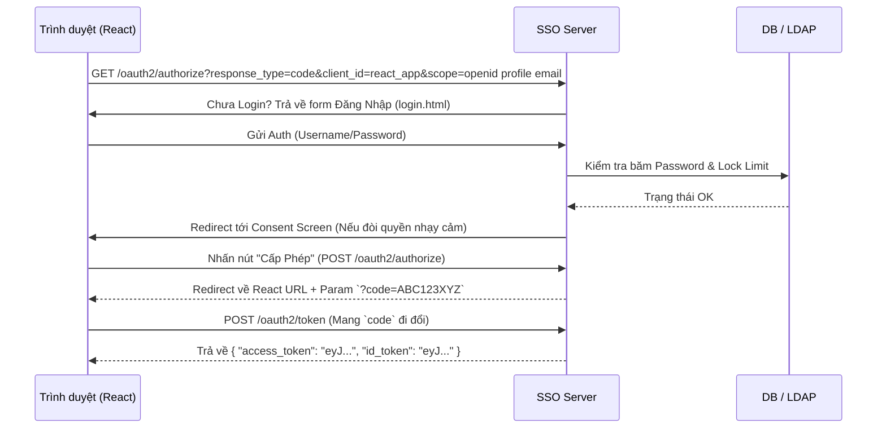
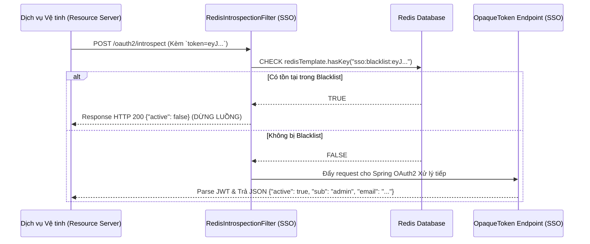
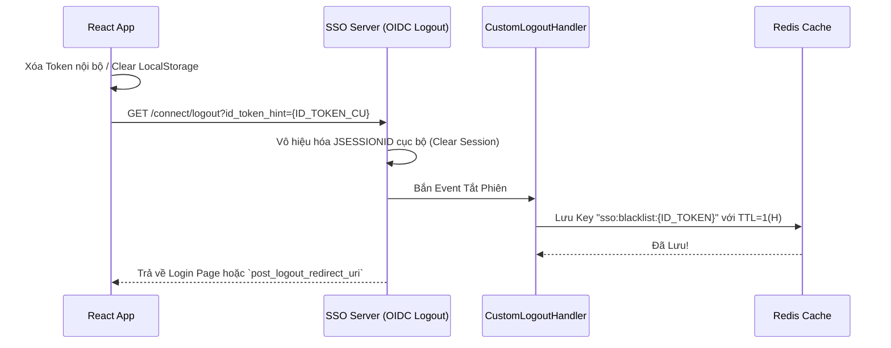

# TÀI LIỆU THIẾT KẾ HỆ THỐNG: SSO OIDC IDENTITY PROVIDER
**Phiên bản:** 1.0.0
**Môi trường:** Production Ready
**Công nghệ lõi:** Spring Boot 3.x, Spring Security, Spring Authorization Server 1.1+, Redis, Kafka, PostgreSQL.

---

## 1. TỔNG QUAN HỆ THỐNG
Dự án SSO Service là một Máy chủ Định danh Tập trung (Identity Provider) tuân thủ hoàn toàn tiêu chuẩn **OAuth 2.0** và **OpenID Connect (OIDC) 1.0**. 
Hệ thống đóng vai trò như một "Chiếc vé thông hành" phân phát quyền truy cập cho toàn bộ hệ sinh thái của doanh nghiệp. Thay vì mỗi dịch vụ con phải tự quản lý Data User & Password, tất cả sẽ Ủy quyền lại cho SSO Server giải quyết.

---

## 2. CHỨC NĂNG NGHIỆP VỤ (BUSINESS FEATURES)

### 2.1 Quản trị Danh tính (Identity Management)
- **Đăng ký / Đăng nhập:** Hệ thống xử lý mã hóa Mật khẩu một chiều bằng bcrypt (độ sâu 12).
- **Màn hình Consent:** Tích hợp quy chuẩn "Chống tự tiện cấp quyền". Nếu App con đòi hỏi đọc Email của User, một màn hình Glassmorphism sẽ hiện ra yêu cầu User bấm "Cho Phép". Kết quả được lưu vĩnh viễn vào DB.

### 2.2 Quản trị Vệ tinh (Client Management)
- **Cơ chế cấp phép APP:** Các dịch vụ (Frontend React, App Mobile, hay Web đối tác thứ 3) muốn liên kết vào SSO đều phải được Admin (Role=ADMIN) khởi tạo `client_id` và `client_secret` thông qua API tại `/api/admin/clients`.

### 2.3 Bảo vệ & Truy vết (Security & Audit)
- **Rate Limiting:** Chống Brute-force mật khẩu. Khi User gõ sai Password quá 5 lần, tài khoản lập tức bị tước quyền đăng nhập (Locked) trong 15 phút.
- **Kafka Audit Log:** Bất kỳ thao tác Đăng nhập Thành công / Thất bại nào đều được gom gói dưới dạng Message Event và nã đạn thẳng vào Topic `sso-audit-events` trên Kafka để phục vụ đội SIEM/Data phân tích bảo mật.

### 2.4 Quản Lý Phiên (Session Management) & Blacklist
- Hệ thống duy trì RSA Key tĩnh (`sso-jwt.jks`) sinh JWT Stateless.
- **Global Logout:** Tích hợp đầu cuối OIDC Logout Endpoint.
- **Redis Blacklist:** Triển khai cơ chế Revoke tức thời. Khi Logout, mã định danh của Token (JTI) bị ném thẳng vào Redis Blacklist. Các lệnh Check Token sau đó sẽ lập tức nhận kết quả "Vô Hiệu Hóa".

---

## 3. THIẾT KẾ KIẾN TRÚC & LUỒNG XỬ LÝ KỸ THUẬT (TECH FLOWS)

### 3.1 Luồng OIDC Code (Ủy quyền bảo mật nhất cho REST/React Frontend)
> **Mục đích:** Cấp phép cho React App lấy được Access Token (JWT) và thông tin cá nhân của người dùng mà KHÔNG làm lộ Mật khẩu hay Client Secret.

---

### 3.2 Luồng Dò Giám Sát Blacklist (Introspection Check)
> **Mục đích:** Để Spring MVC Resource Server xác nhận xem Access Token (JWT) do Client gửi lên có còn hợp lệ hay dã bị User chủ động bấm Logout.

---

### 3.3 Luồng Thu Hồi Toàn Cục (Global RP-Initiated Logout)
> **Mục đích:** Khi người dùng muốn Đăng Xuất từ App React, làm thế nào App React cắt được cả Session ở Client và Session ở Server SSO?

---

## 4. CHI DIỆN DATABASE TÓM LƯỢC

1. `users`: Lưu account (username, password, locked_until...).
2. `roles`: Lưu danh mục quyền hạn hệ thống (ADMIN, USER).
3. `oauth2_registered_client`: Lưu Client ID và Setting cho phép ứng dụng bên thứ 3 tương tác. Chứa các tham số Scope cho phép và redirect URI tương ứng.
4. `oauth2_authorization_consent`: Bảng nối lưu giá trị xác nhận (Người dùng X đã bấm đồng ý cung cấp thông tin cho Client Y).
5. `audit_log`: Sẵn sàng phục vụ ghi log tĩnh ngoài hệ sinh thái Kafka.

## 5. TÙY CHỈNH SCOPE (JWT CLAIMS)
Dữ liệu sinh JWT payload tuân thủ tư duy "Tiết kiệm băng thông":
- Chỉ cấp `userId`, `username` nếu FrontEnd yêu cầu `scope=profile`.
- Chỉ cấp `email`, `email_verified` nếu FrontEnd yêu cầu `scope=email`.
- Chỉ cấp mảng `roles: [...]` nếu Frontend yêu cầu `scope=roles`. 
Cơ chế này bóp chặt dữ liệu Data DTO rác, giúp tăng tốc độ xử lý gói tin đi qua Network ở các API Gateway.
